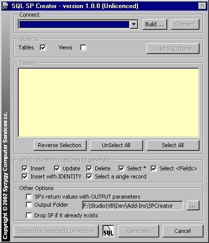



## SQL Stored Procedure Creator

### Description

SQL Server Stored Procedure Creator

Are you tired of having to manually create stored procedures to simply perform Insert, Update, Delete and Select functions on each of the tables and views in a newly created database ?

If you answered YES to the above - this VB6 add-in is for you.

I got tired of having to repeat the same steps each and every time I created a new SQL database, so I decided to automate the process for me.

I've tested the Stored Procedures created on SQL Server 7.0 and SQL Server 2000.

On a database with 21 tables - this add-in created a total of 184 different Stored Procedures for me when I selected all the options. That's 184 Stored Procedures that I didn't have to code myself.

It will allow you to connect to the SQL Server database of your choice and to create the following 'default' stored procedures for you :

- Insert

- Insert with Identity

- Update

- Delete

- Select *

- Select <column list>

- Select single record using ID / Key

There are a few options available to the user when generating the Stored Procedures :

- Drop stored procedure before creating the new one

- Return ID of newly inserted record as an OUTPUT parameter or as a SELECT statement

- Update the database directly or create a Script file

This is Version 1 of the add-in and it is sufficient for my current needs.

I can foresee several enhancements, but am not sure when I'll be able to get round to them :

- formatting the text in the Stored Procedure to make it more human readable

- enhance the error checking and handling

- licence routines etc.

You will need to compile the DLL in order to use it.

Neat Stuff :

This code demonstrates how to create a VB6 add-in, how to create a menu item under the Add-Ins menu that has a short-cut key as well as an icon, using ADO to retrieve information about the database, creating an ADO connection at run-time whilest allowing the user to select the connection properties, registry access and several other techniques.

Please leave comments and opinions. I'm very keen to find out what other people think about this project.

Thanx,

Alon
 
### More Info
 
If the add-in encounters an error that has not been handled in the code - you will need to CLOSE VB in order to close the Add-in

             |
---                |---
**Submitted On**   |2002-10-10 13:41:12
**By**             |[Alon Hirsch](https://github.com/Planet-Source-Code/PSCIndex/blob/master/ByAuthor/alon-hirsch.md)
**Level**          |Advanced
**User Rating**    |4.9 (34 globes from 7 users)
**Compatibility**  |VB 6\.0
**Category**       |[OLE/ COM/ DCOM/ Active\-X](https://github.com/Planet-Source-Code/PSCIndex/blob/master/ByCategory/ole-com-dcom-active-x__1-29.md)
**World**          |[Visual Basic](https://github.com/Planet-Source-Code/PSCIndex/blob/master/ByWorld/visual-basic.md)
**Archive File**   |[SQL\_Stored14633010152002\.zip](https://github.com/Planet-Source-Code/alon-hirsch-sql-stored-procedure-creator__1-39849/archive/master.zip)

### API Declarations

Some - check the code

